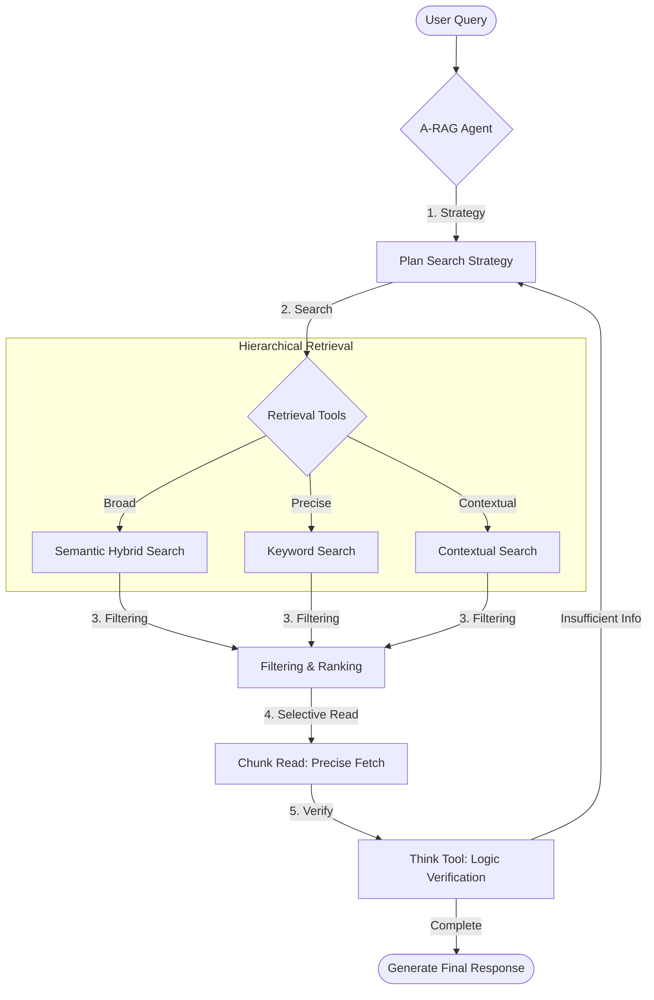

# A-RAG: Research Paper Analysis Agent

[](https://www.python.org/)
[](https://fastapi.tiangolo.com/)
[]()

[🇰🇷 한국어 (Korean)](./README.md) | [🇺🇸 English](./README.en.md)

This project is a **Research Paper Analysis Agent** implementation inspired by the paper [A-RAG: Scaling Agentic Retrieval-Augmented Generation via Hierarchical Retrieval Interfaces](https://arxiv.org/pdf/2602.03442) and the [original repository](https://github.com/Ayanami0730/arag).

Built on the **`langchain-deepagents` (v0.4.1)** framework, it combines **Hierarchical Retrieval** with **Agentic Reasoning** to accurately analyze and summarize information in complex domains such as academic papers.

## 🧠 Core Philosophy: A-RAG (Agentic RAG)

**"Search is a Hint (Signal), Reading is Confirmation (Fact)."**



Instead of following a fixed workflow, this agent aims for **Autonomous Strategy**, where the model plans and executes retrieval itself.

1. **Hierarchical & Iterative**: It **interleaves** tools of varying granularity (`Keyword` ↔ `Semantic` ↔ `Chunk Read`) to iteratively refine its understanding.
2. **Progressive Acquisition**: It doesn't read everything at once. The agent uses `Search` to get hints and only `Read`s what it deems valuable, **minimizing context overhead**.
3. **Agentic Loop**: This is not just a mechanical summarizer. Through the `Action → Observation → Reasoning` loop, if information is insufficient, the agent autonomously rewrites queries or explores alternative paths.

## ⚠️ Prerequisites

> [!IMPORTANT]
> This project relies heavily on **Azure Cloud Resources**. It cannot run solely on a local machine without them.

1. **Azure OpenAI**:
    - `gpt-5-mini` or equivalent Chat Model (for the main agent)
    - `text-embedding-3-*` (Embedding Model)
2. **Azure AI Search**:
    - A search service with indexed research paper data is required.
    - **Required Index Schema**: `id`, `content`, `title`, `source_file`, `page_number`, `embedding`, etc.
    - The project uses `semantic_hybrid_search` and `contextual_search` (page context re-ranking), so the index must be configured accordingly.

## ✨ Key Features

- **🔍 Hierarchical & Hybrid Search**:
  - `semantic_hybrid_search`: Explores broad topics using embedding (semantic) + keyword search.
  - `contextual_search`: Reconstructs the context of texts, figures, and tables scattered across pages for searching.
  - `keyword_search`: Precisely targets proper nouns or specific terms.
- **🔬 Deep Analysis**:
  - `chunk_read`: Reads not just simple text but also adjacent chunks to understand the context.
  - `research_paper_think`: Before answering, the agent critiques itself to check for logical leaps or insufficient evidence.

## 🚀 Quickstart

### 1. Environment Setup

Python 3.11+ and `uv` package manager are required.

```bash
# Copy environment variable template
cp default.env .env
```

Open `.env` and fill in your Azure configurations:

- `OPENAI_ENDPOINT`, `OPENAI_API_KEY` (Azure OpenAI)
- `AZURE_SEARCH_ENDPOINT`, `AZURE_SEARCH_API_KEY`
- `AZURE_SEARCH_API_RESEARCH_PAPER_INDEX`: Index name to use

### 2. Run Server

```bash
./start_server.sh
# OR
uv run uvicorn paper_analysis_deepagents.api:app --host 0.0.0.0 --port 8000 --reload
```

- **API Docs**: [http://localhost:8000/docs](http://localhost:8000/docs)
- **Agent Endpoint**: `POST /agents/research-paper-summary/invoke`
- **Streaming Endpoint**: `POST /agents/research-paper-summary/invoke/stream` (SSE)

### 3. Streaming Execution

Use `/invoke/stream` to receive responses in real-time (SSE). This is essential for frontend integration.

```bash
curl -N -X POST 'http://localhost:8000/agents/research-paper-summary/invoke/stream' \
  -H 'accept: text/event-stream' \
  -H 'Content-Type: application/json' \
  -d '{
    "query": "Summarize the Transformer paper",
    "conversationId": "test-stream-001"
  }'
```

Event Types:

- `event: message`: Token stream (data: "...")
- `event: reference`: List of referenced documents during the process
- `event: update`: Tool call information (tool_start, etc.)
- `event: done`: Final completion (includes content, citations)

## Project Structure

```bash
paper_analysis_deepagents/       # Main Package
├── research_paper_summary_agent.py  # Agent Definition (System Prompt, Tool Assembly)
├── tools/
│   ├── azure_search.py          # Azure Search Client
│   ├── research_paper_search.py # Search/Read Tool Implementation
│   └── research_paper_think.py  # A-RAG Reasoning (Think) Tool
├── history/                     # Chat History Storage (Local JSON)
└── api.py                       # FastAPI Application
skills/                          # DeepAgents Skills (Markdown-based instructions)
tests/                           # Unit and Integration Tests
```

## Usage Example (Python)

```python
import requests

response = requests.post(
    "http://localhost:8000/agents/research-paper-summary/invoke",
    json={
        "query": "What are the core contributions of the Transformer paper?",
        "conversationId": "test-conv-en-001"
    }
)
print(response.json()["content"])
```

## Open Source

This is an open source project open to anyone for use and contribution.
print(response.json()["content"])

```
