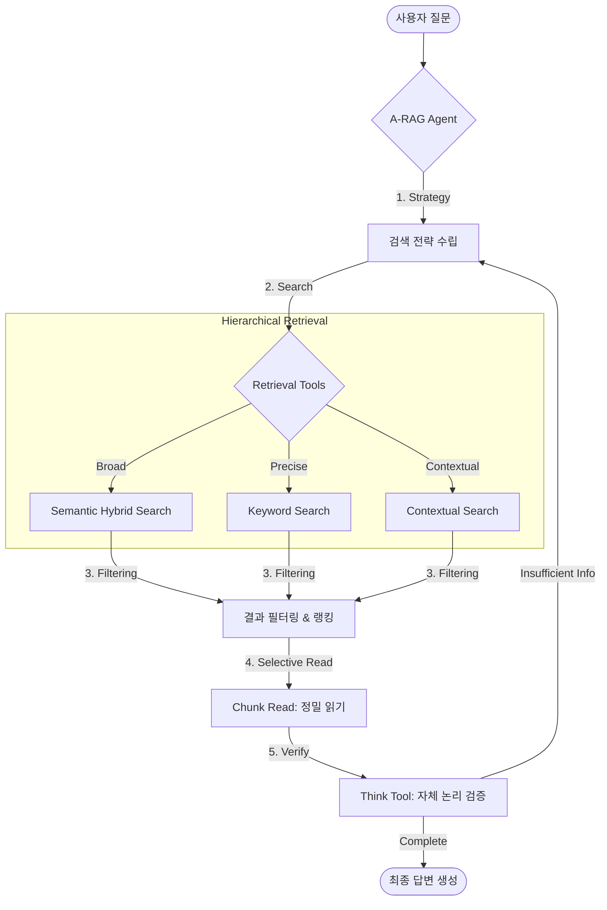

# A-RAG: 연구 논문 분석 에이전트 (Research Paper Analysis Agent)

[](https://www.python.org/)
[](https://fastapi.tiangolo.com/)
[]()

[🇰🇷 한국어 (Korean)](./README.md) | [🇺🇸 English](./README.en.md)

이 프로젝트는 [A-RAG: Scaling Agentic Retrieval-Augmented Generation via Hierarchical Retrieval Interfaces](https://arxiv.org/pdf/2602.03442) 논문 및 [원본 레포지토리](https://github.com/Ayanami0730/arag)에서 영감을 받아 구현된 **연구 논문 분석 에이전트**다.

**`langchain-deepagents` (v0.4.1)** 프레임워크를 기반으로 구축되었으며, 복잡한 도메인(학술 논문)의 정보를 정확하게 분석하고 요약하기 위해 **계층적 검색(Hierarchical Retrieval)**과 **에이전트의 추론(Reasoning)**을 결합했다.

## 🧠 핵심 철학: A-RAG (Agentic RAG)

**"모델이 스스로 판단하는 검색: 힌트(신호)에서 사실(확정)로."**



이 프로젝트는 고정된 워크플로우를 따르는 대신, 에이전트가 **스스로 검색 전략을 수립하고 실행하는 자율성(Autonomous Strategy)**을 지향한다.

1. **Hierarchical & Iterative**: `Keyword` ↔ `Semantic` ↔ `Chunk Read` 등 다양한 입도의 도구들을 상황에 맞춰 **교차 사용(Interleaved Tool Use)**하며 정답에 다가간다.
2. **Progressive Acquisition (점진적 습득)**: 검색된 모든 내용을 읽지 않는다. `Search`로 힌트를 얻고, 모델이 "읽을 가치가 있다"고 판단한 부분만 `Read`하여 **문맥 부하(Overhead)를 최소화**한다.
3. **Agentic Loop**: 단순히 검색 결과를 요약하는 기계적인 RAG가 아니다. `Action(검색) → Observation(결과) → Reasoning(판단)`의 루프를 통해, 정보가 불충분하면 스스로 쿼리를 수정하거나 다른 경로를 탐색한다.

## ⚠️ 필수 요구사항 (Prerequisites)

> [!IMPORTANT]
> 이 프로젝트는 **Azure 클라우드 자원**에 강하게 의존한다. 로컬 단독 실행은 불가능하며, 아래 리소스가 반드시 필요하다.

1. **Azure OpenAI**:
    - `gpt-5-mini` 또는 동급의 Chat 모델 (메인 에이전트용)
    - `text-embedding-3-*` (임베딩 모델)
2. **Azure AI Search**:
    - 논문 데이터가 인덱싱된 검색 서비스가 필요하다.
    - **필수 인덱스 스키마**: `id`, `content`, `title`, `source_file`, `page_number`, `embedding` 등
    - 이 프로젝트는 `semantic_hybrid_search`와 `contextual_search`(페이지 맥락 재정렬) 기능을 사용하므로, 인덱스가 이에 맞춰 구성되어 있어야 한다.

## ✨ 주요 기능 (Features)

- **🔍 계층적 & 하이브리드 검색**:
  - `semantic_hybrid_search`: 임베딩(의미) + 키워드 검색으로 넓은 범위의 주제를 탐색한다.
  - `contextual_search`: 페이지 단위로 흩어진 텍스트, 그림, 표의 맥락을 재구성하여 검색한다.
  - `keyword_search`: 고유명사나 특정 용어를 정밀하게 타격한다.
- **🔬 심층 분석 (Deep Analysis)**:
  - `chunk_read`: 단순 텍스트뿐만 아니라 인접한 청크를 함께 읽어 문맥을 파악한다.
  - `research_paper_think`: 답변 작성 전, 논리적 비약은 없는지, 근거는 충분한지 스스로 비평한다.

## 🚀 시작하기 (Quickstart)

### 1. 환경 설정

Python 3.11 이상과 `uv` 패키지 매니저가 필요하다.

```bash
# 환경변수 템플릿 복사
cp default.env .env
```

`.env` 파일을 열어 Azure 설정을 입력한다:

- `OPENAI_ENDPOINT`, `OPENAI_API_KEY` (Azure OpenAI)
- `AZURE_SEARCH_ENDPOINT`, `AZURE_SEARCH_API_KEY`
- `AZURE_SEARCH_API_RESEARCH_PAPER_INDEX`: 사용할 인덱스 이름

### 2. 서버 실행

```bash
./start_server.sh
# 또는
uv run uvicorn paper_analysis_deepagents.api:app --host 0.0.0.0 --port 8000 --reload
```

- **API 문서**: [http://localhost:8000/docs](http://localhost:8000/docs)
- **에이전트 엔드포인트**: `POST /agents/research-paper-summary/invoke`
- **스트리밍 엔드포인트**: `POST /agents/research-paper-summary/invoke/stream` (SSE)

### 3. 스트리밍 실행 (Streaming)

응답을 실시간으로(SSE) 받으려면 `/invoke/stream`을 사용한다. 프론트엔드 연동 시 필수다.

```bash
curl -N -X POST 'http://localhost:8000/agents/research-paper-summary/invoke/stream' \
  -H 'accept: text/event-stream' \
  -H 'Content-Type: application/json' \
  -d '{
    "query": "Transformer 논문 요약해줘",
    "conversationId": "test-stream-001"
  }'
```

이벤트 타입:

- `event: message`: 토큰 스트림 (data: "...")
- `event: reference`: 중간에 참고한 문서 목록
- `event: update`: 도구 호출 정보 (tool_start 등)
- `event: done`: 최종 완료 (content, citations 포함)

## 📝 Citation

이 프로젝트에서 사용된 A-RAG 알고리즘 연구를 인용하시려면 아래의 BibTeX를 사용해 주세요:

```bibtex
@misc{du2026aragscalingagenticretrievalaugmented,
      title={A-RAG: Scaling Agentic Retrieval-Augmented Generation via Hierarchical Retrieval Interfaces},
      author={Mingxuan Du and Benfeng Xu and Chiwei Zhu and Shaohan Wang and Pengyu Wang and Xiaorui Wang and Zhendong Mao},
      year={2026},
      eprint={2602.03442},
      archivePrefix={arXiv},
      primaryClass={cs.CL},
      url={https://arxiv.org/abs/2602.03442},
}
```

## 프로젝트 구조

```bash
paper_analysis_deepagents/       # 메인 패키지
├── research_paper_summary_agent.py  # 에이전트 정의 (시스템 프롬프트, 도구 조립)
├── tools/
│   ├── azure_search.py          # Azure Search 클라이언트
│   ├── research_paper_search.py # 검색/읽기 도구 구현체
│   └── research_paper_think.py  # A-RAG 추론(Think) 도구
├── history/                     # 대화 기록 저장소 (로컬 JSON)
└── api.py                       # FastAPI 애플리케이션
skills/                          # DeepAgents Skills (마크다운 기반 업무 지침)
tests/                           # 단위 및 통합 테스트
```

## 사용 예시 (Python)

```python
import requests

response = requests.post(
    "http://localhost:8000/agents/research-paper-summary/invoke",
    json={
        "query": "Transformer 논문의 핵심 기여가 무엇인가요?",
        "conversationId": "test-conv-kr-001"
    }
)
print(response.json()["content"])
```
